# apigee_build_jenkins_example3_maven

# Summary
This repository demonstrates how to configure Jenkins to deploy Apigee Edge proxies and execute tests.  

There are two sections:
1. [Jenkins Build Triggered Manually](#jenkins-build-triggered-manually)
  * [`apigee_build_jenkins_example3_maven_current`](#apigee_build_jenkins_example3_maven_current)
  * [`apigee_build_jenkins_example3_maven_tests`](#apigee_build_jenkins_example3_maven_tests)
  * [`apigee_build_jenkins_example3_maven_prod`](#project-apigee_build_jenkins_example3_maven_prod)
2. [Jenkins Build Triggered from Github commit hook](#jenkins-build-triggered-from-github-commit-hook)
  * [demo](#add-new-feature-demo)
  * [Github Configuration](#github-configuration)
  * [Jenkins Configuration](#jenkins-configuration)
  * [Build/Deploy Job](#pullrequestbuilder_apigee_build_jenkins_example3_maven)
  * [Test Job](#pullrequestbuilder_apigee_build_jenkins_example3_maven_tests)
  * [Deploy job](#githook_apigee_build_jenkins_example3_maven_prod)

# Jenkins Build Triggered Manually
This section describes how to configure Jenkins so that it will
* deploy the Apigee Edge proxy located in the catalogs folder to the test environment
* execute JMeter tests located in another repository
  * Sample JMeter tests are actually located in the `catalogs/tests` folder.
* deploy the same proxy to the prod environment
  * It should be noted that this will create a new revision in Apigee Edge in the prod environment; it will not deploy the same proxy revision in test to prod. This would require a slightly different setup.

## Jenkins Jobs Summary
There are three Jenkins Jobs and all three are maven jobs.

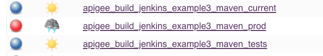

1. [`apigee_build_jenkins_example3_maven_current`](#apigee_build_jenkins_example3_maven_current)
  * This job must be executed manually.  
  * It clones the repository, builds the Apigee Proxy bungle and deploys it to Apigee Edge.  
2. [`apigee_build_jenkins_example3_maven_tests`](#apigee_build_jenkins_example3_maven_tests)
  * This is executed only if the first job executes successfully.
  * It executes the JMeter tests against the test environment and publishes the results.
3. [`apigee_build_jenkins_example3_maven_prod`](#project-apigee_build_jenkins_example3_maven_prod)
  * This job is executed only if the previous job executes successfully.
  * It copies the workspace from the first job and uses that to deploy the proxy to the prod environment.  
  * The reason for this is to ensure that we are using the same proxy bundle that was tested against in the first job.  If we pulled the repository again, then we run the risk that a commit could have been executed against the repository (so the repo may have changed).  This ensures the proxy deployed to test and prod are the same.  

Why have the second build?  The reason is that JMeter needs some configuration before we can execute the tests, and I didn't have time to complete the customization of it so that my Apigee Edge domain name is not stored in a public repo.  

## apigee_build_jenkins_example3_maven_current

### General Config and parameters
This is a maven build job.

* Grants permission to another job to copy artifacts.
* Parameters are:
  * apigee org name
  * parent module = yes - TODO Why did I do this?


### Source Code
* Using Git to pull the repo and pulls from the master branch only.

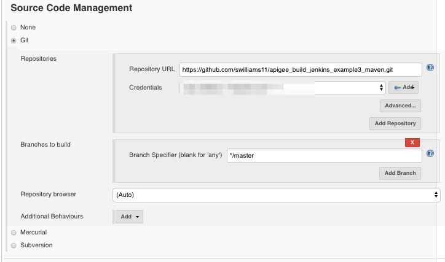

### Build Triggers
* No build triggers because you have to trigger this job manually.

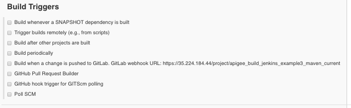

### Build Env
* The build environment is set to delete the workspace first and use a secret text file for the Apigee Edge org admin username and password for the Maven deployment command.

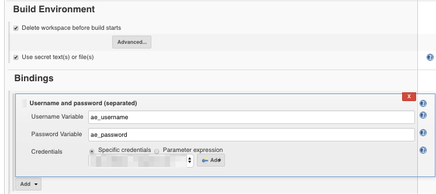

### Post Build
* No Presteps
* Build
  * Root POM: `catalogs/pom.xml`
  * Goals and options: `install -Ptest -Dusername=$ae_username -Dpassword=$ae_password   -Dorg=$ae_org`
* Postbuild Action is to archive the Apigee Edge zip file.

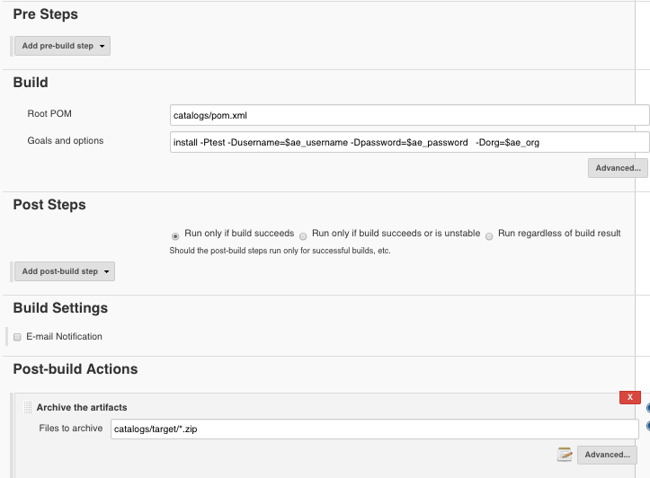


## apigee_build_jenkins_example3_maven_tests
This job executes the JMeter tests against the proxy deployed to the test environment.

### Source Code
* The source code is stored in a private Gitlab repository.

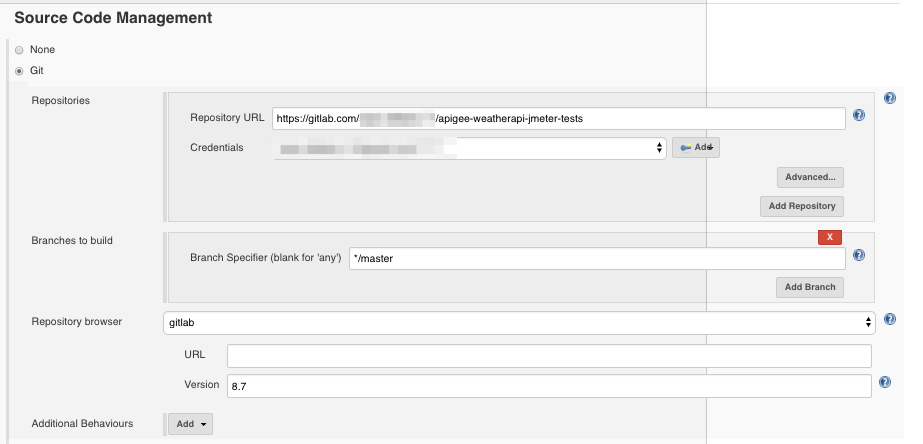

### Build Triggers
* This project is only built if the first job succeeds.

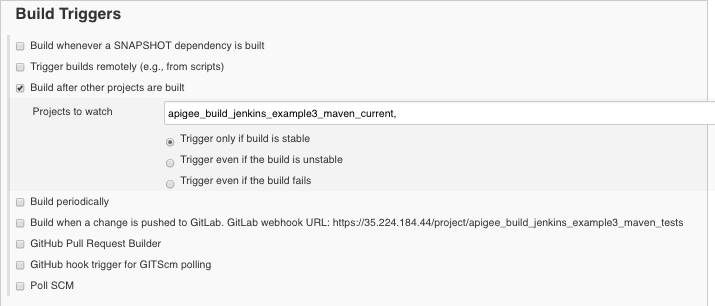

### Build Env and Build
* Delete the current workspace before building.
* Build
  * Root POM: `pom.xml`
  * Goals and options: `clean verify -Ptest`

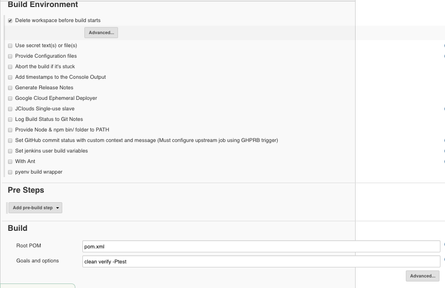

### Post build action
* Public the performance report.
  * Source data files: `**/*.jtl`
  * Select Mode: `Error Threshold` which means that the build will be marked as unstable when 1% of the test failed and the build will fail when 1% of the tests fail.  

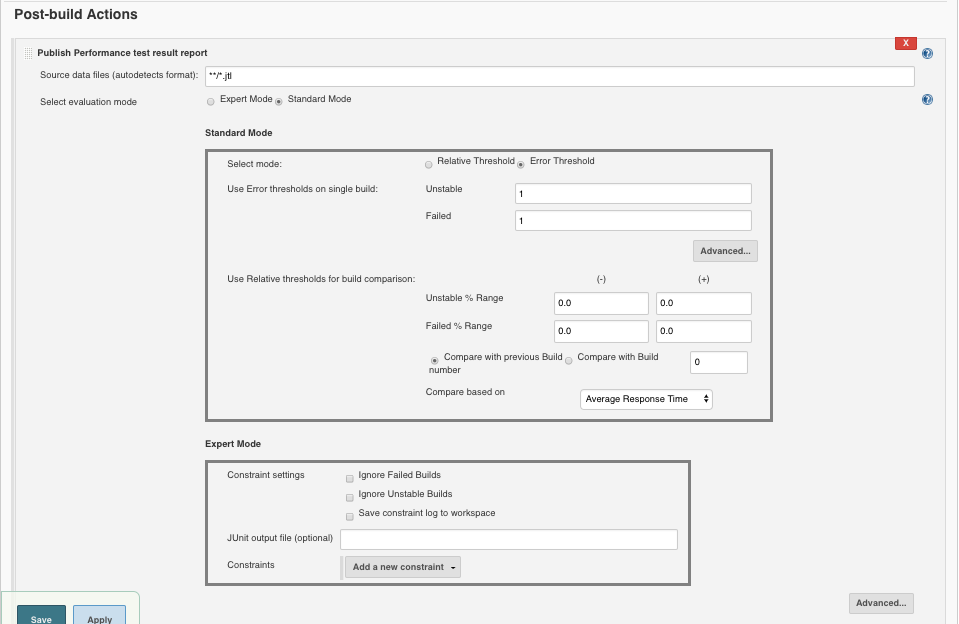


## project apigee_build_jenkins_example3_maven_prod
This job builds the Apigee bundle and deploys to the prod environment.

### General Settings
* The Apigee Edge org and environment are build parameters.

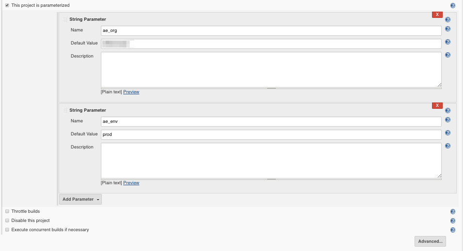

### Build triggers
* There is no source control for this project, because it uses the workspace from the first build.  This ensures that the source code has not changed between builds.
* Build Triggers
  * This job is executed only if the job that executes the JMeter tests succeeds.

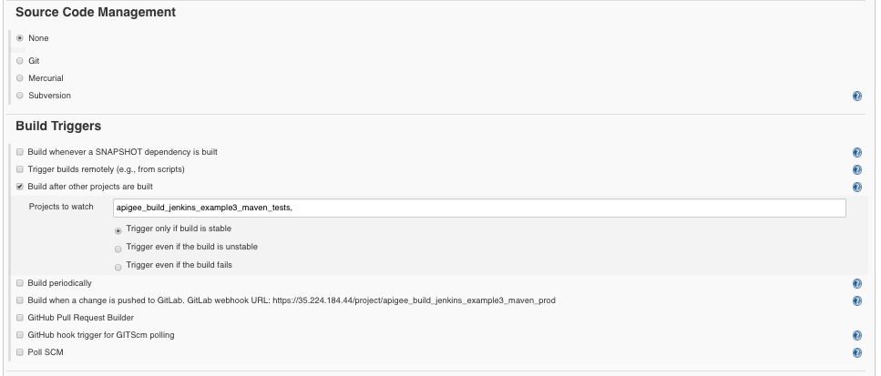

### Build Env
* Delete the workspace and use a secret text file for the Apigee org admin and password that are passed to the Apigee Maven build command.

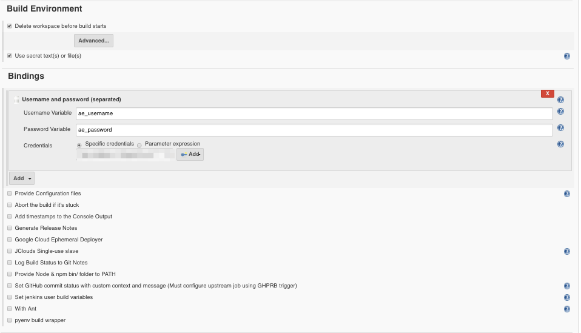

### Presteps and Build
* Presteps
  * copies workspace from first job that executed successfully.
  * Artifacts not to copy: `apigee_build_jenkins_example3_maven_current/apigee:catalogs_maven`
    * This is an attempt to avoid copying the submodule that gets created, but it still copies it.
* Build
  * Root POM: `catalogs/pom.xml`
  * Goals and options: `install -P$ae_env -Dusername=$ae_username -Dpassword=$ae_password   -Dorg=$ae_org`
    * notice this deploys to the prod envrionment and it will deploy a new revision to prod with the same code.


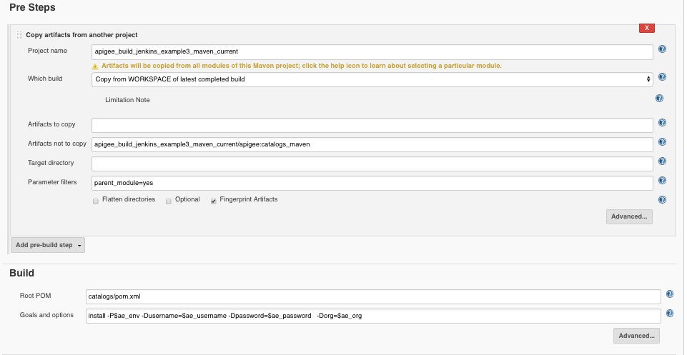

### Post Build
* Final step is to push the code back to Github. The only reason for this is if you are using branches.  This demo does not use branches and merge commits so there is no need to merge the code back to the remote repository.

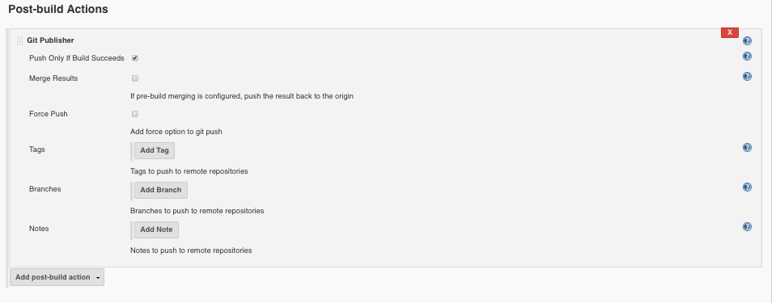


## TODOS
1. Update JMeter test scripts so that configuration can be passed from the command line.
2. Update the second job to pass config via the command line and use the tests in this repository instead of a Gitlab repo.

# Jenkins Build Triggered from Github commit hook
This section describes how to demo the Jenkins Build triggered from a Github commit and it also describes the Jenkins jobs.  

This demo uses feature branches.  The typical process is:
* a developer would clone the master branch
* create a new feature branch based off the master branch and make all of their changes to that branch.
* add test cases and test in the Apigee dev environment
* submit a pull request to the master branch or whatever branch they cloned from

## TOC
* [demo](#add-new-feature-demo)
* [Github Configuration](#github-configuration)
* [Jenkins Configuration](#jenkins-configuration)
* [Build/Deploy Job](#pullrequestbuilder_apigee_build_jenkins_example3_maven)
* [Test Job](#pullrequestbuilder_apigee_build_jenkins_example3_maven_tests)
* [Deploy job](#githook_apigee_build_jenkins_example3_maven_prod)

## Add New Feature Demo
This section describes the typical Apigee developer adding a new feature (updating a proxy) in Github.

1. Clone this repository.  Master branch will be checkout by default.
`git branch` will show all the branches available and the current one that you are on.

```
git clone https://github.com/swilliams11/apigee_build_jenkins_example3_maven.git
git branch
```

2. Create a new branch from the master branch on your local machine.
```
git checkout -b feature6
```

3. Add a new flow to the proxy. Open the `default.xml` file located in `catalogs/apiproxy/proxies`. Add the following code to the `<Flows>` element below the element named `<Flow name="flow status"></Flow>`

```xml
  <Flow name="Create Catalog">
       <Description>Create a new catalog item.</Description>
       <Request>
       </Request>
       <Response/>
       <Condition>(proxy.pathsuffix MatchesPath "/") and (request.verb = "POST")</Condition>
   </Flow>
```

4. Save the code and commit it to your local repository.
```
git commit -am "added a new flow for feature 6"
```

5. Push the code to your remote branch.  If you go back to your Github repository you will see the new feature branch created.  

```
git push origin feature6
```

6. Create a pull request in Github to merge the feature branch with the master branch.
  * starts the Jenkins job that is listening for pull request
  * deploy the code to the test environment
  * test code deployed to test environment and if all tests pass then merge the feature branch into master
  * close the pull request
  * you can optionally delete the feature branch as well  


## Github Configuration
The following shows the Github configuration that should be enabled to support commmit hooks.

**Looks like Post commit hooks is deprecated. Will need to find an alternative solution.**
https://developer.github.com/changes/2018-04-25-github-services-deprecation/

https://developer.github.com/v3/guides/replacing-github-services/

**Could use this Jenkins plugin instead**
https://wiki.jenkins.io/display/JENKINS/Generic+Webhook+Trigger+Plugin

## Jenkins Configuration
There are three jobs here as well.
1. `pullrequestbuilder_apigee_build_jenkins_example3_maven`
  * listens for pull requests
  * deploys proxy to test environment
  * executes job to test deployment
  * merges code to master branch
  * closes pull request
2. `pullrequestbuilder_apigee_build_jenkins_example3_maven_tests`
  * executes JMeter tests
  * reports results
3. `githook_apigee_build_jenkins_example3_maven_prod`
  * listens for commits on the master branch
  * deploys code to prod environment
  * should also execute test against prod env
  * would theoretically deploy to next higher environment

### Prerequisites
* [Github pull request plugin](https://wiki.jenkins.io/display/JENKINS/GitHub+pull+request+builder+plugin)
* [Github plugin](https://wiki.jenkins.io/display/JENKINS/GitHub+Plugin)

### pullrequestbuilder_apigee_build_jenkins_example3_maven

#### General Config
* This is a Github project and includes parameters.
* I should remove the parent_module = yes parameter.


#### Source Code Config
* Using the Github pull request plugin to listen for pull requests
* fetches code from pull request
* merges code back to the master branch locally (on Jenkins)

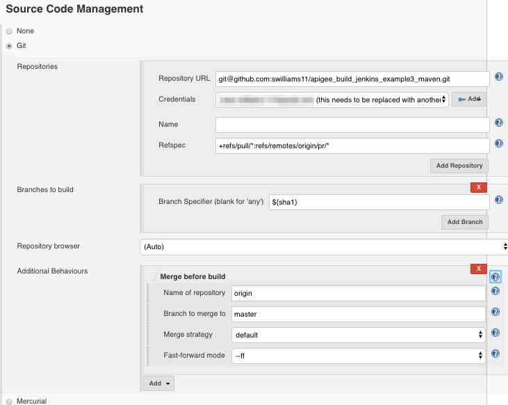

#### Build Trigger
* Uses Github Pull Request Builder
* make sure "Use github hooks for build triggering" is selected.

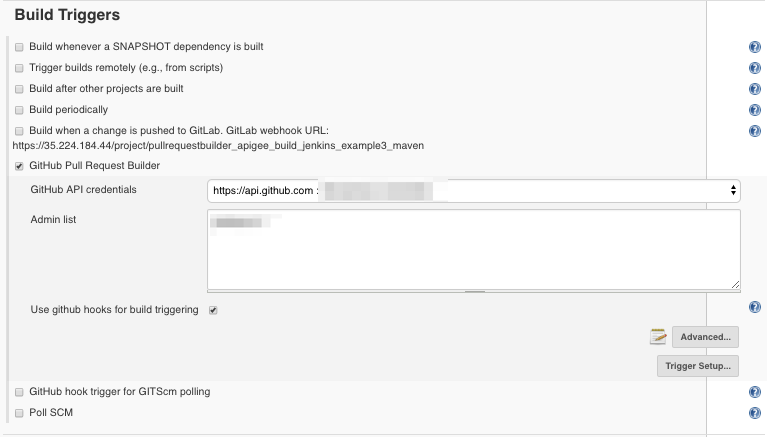

#### Build Environment and Bindings
* Build environment uses Apigee org admin username and password.

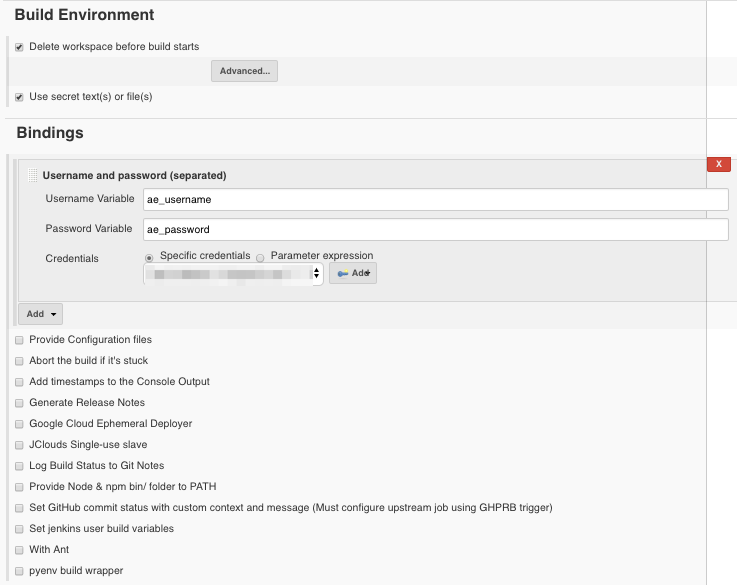

#### Build and Post Build Steps
* Build
  * `catalogs/pom.xml`
  * `install -Ptest -Dusername=$ae_username -Dpassword=$ae_password   -Dorg=$ae_org`
* Post Steps
  * `pullrequestbuilder_apigee_build_jenkins_example3_maven_tests`
  * block current build until the testing is complete and fail the current build if the test build is unstable or fails.

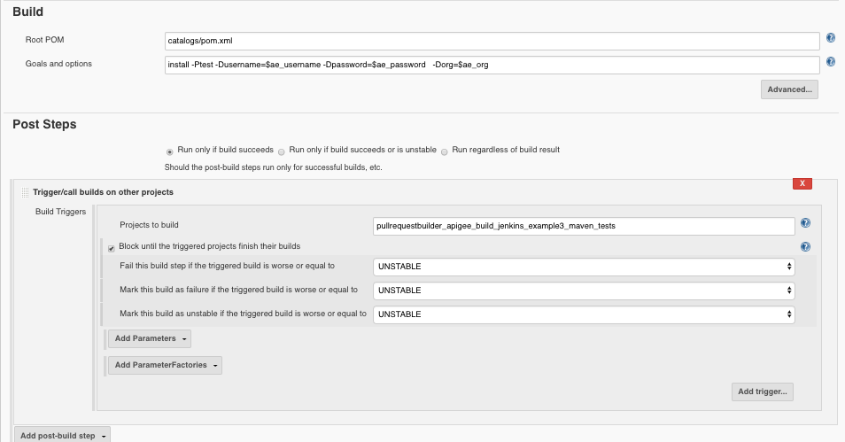

#### Post Build Actions
* Post build actions
  * Archive the bundle
    * `catalogs/target/*.zip`
  * Merge the code and push it back to the remote master branch

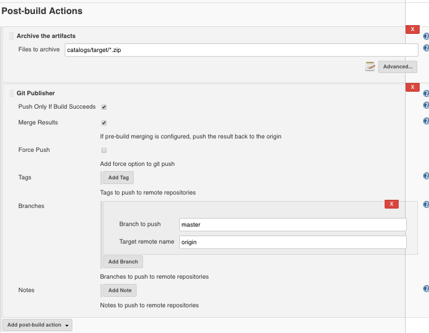


### pullrequestbuilder_apigee_build_jenkins_example3_maven_tests


#### General Config
Nothing is selected here.

#### Source Code


#### Build Trigger
None. This job is called by the previous job.  

#### Build environment and Build
* Delete the current workspace before building.
* Build
  * Root POM: `pom.xml`
  * Goals and options: `clean verify -Ptest`


#### Post Build Actions
* Public the performance report.
  * Source data files: `**/*.jtl`
  * Select Mode: `Error Threshold` which means that the build will be marked as unstable when 1% of the test failed and the build will fail when 1% of the tests fail.  


### githook_apigee_build_jenkins_example3_maven_prod

#### General Settings

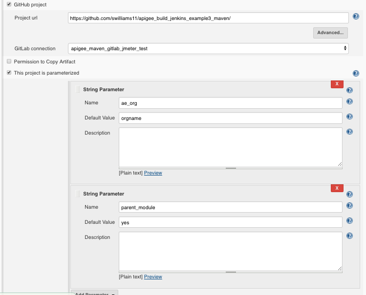

#### Source Code

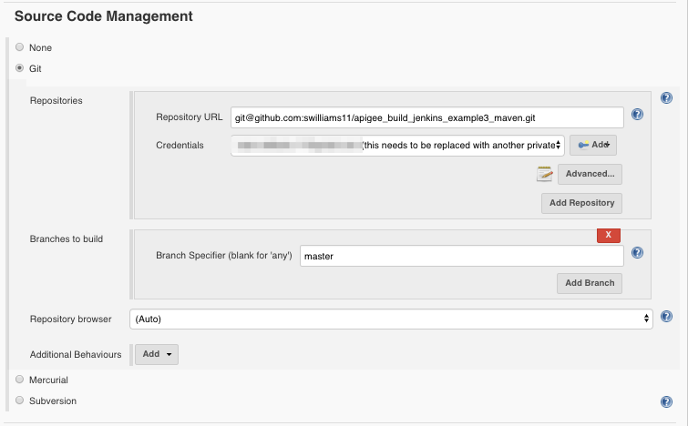

#### Build Trigger
Select **Github hook trigger for GITScm pooling**

**Keep in mind that this feature is now deprecated.**

#### Build Env and Bindings
* Delete the workspace and use a secret text file for the Apigee org admin and password that are passed to the Apigee Maven build command.


#### Build and Post Build Steps
* Build
  * `catalogs/pom.xml`
  * `install -Pprod -Dusername=$ae_username -Dpassword=$ae_password   -Dorg=$ae_org`
* Post Steps
  * `pullrequestbuilder_apigee_build_jenkins_example3_maven_tests`
  * block current build until the testing is complete and fail the current build if the test build is unstable or fails.

**Note that this step should execute tests against the prod environment**


#### Postbuild actions
* `catalogs/target/*.zip`

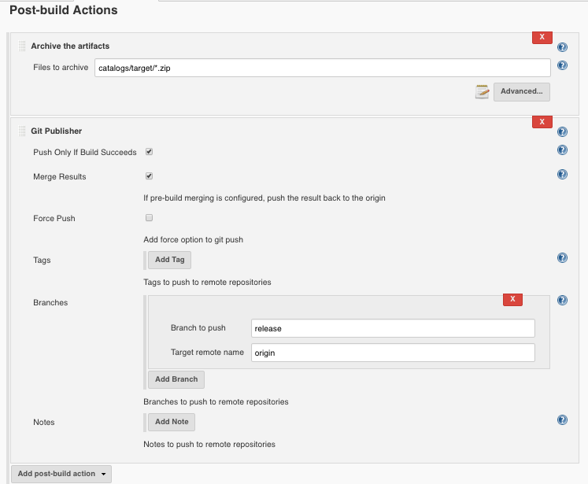

## TODOS
* update Jenkins build to use this new generic webhook instead.
https://wiki.jenkins.io/display/JENKINS/Generic+Webhook+Trigger+Plugin


# Scratch Pad
Tests Jenkins post-commit hook to my public openshift-jenkins application.

Testing post commit hook5\  
